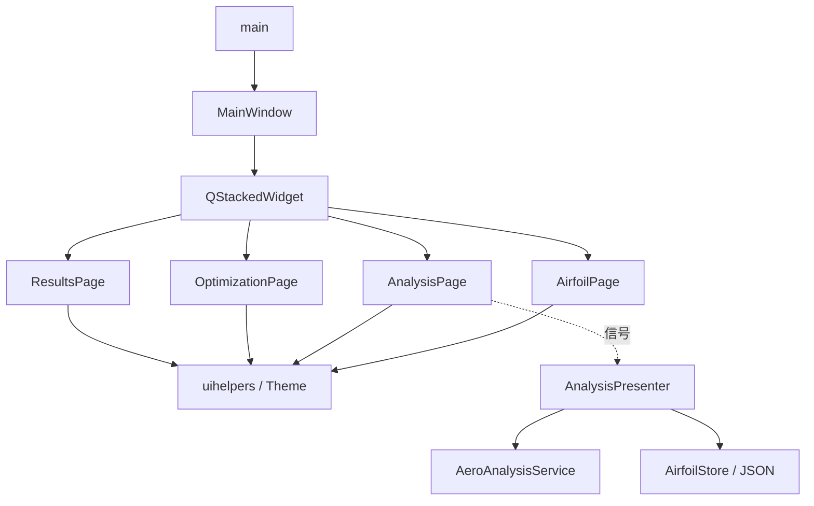

# 架构

## 现状

单进程 Qt Widgets：**main → MainWindow → 四个 Page → uihelpers / Theme**。
多数页面为 UI 原型（演示数据在 `*page.cpp`，操作多经 `wireDummyAction`）。

**分层样板（已落地）**：翼型气动分析是唯一完整的 View→Presenter→Service→本地数据 闭环——`AnalysisPage` → `AnalysisPresenter` → `AeroAnalysisService` / `AirfoilStore`（`airfoil_analysis.json`）。其余功能域仍为原型。



**数据流**：

- 原型页：源码字面量 → Page 构造组装 → 屏幕显示；表单可改但不写回模型。
- 气动分析：翼型参数编辑 → snapshot 输入 → Presenter → Service 计算 + Store 落盘；结果经 Presenter 调用 View 的 `setResult` 最小刷新。

**配置**：无通用运行时配置 / `QSettings` 业务解析。CMake 固定 AUTOMOC/UIC/RCC、`Qt::Widgets`、include=`./`、`./ui`、`./model`、`./service`、`./controller`、MinGW UTF-8。`main` 设置 `OrganizationName=AeroDesignOpt`（供 AppData 路径）。硬编码：`Theme`、窗口尺寸、各页演示字段。

链接依赖仅 `Qt::Widgets`。无 `.qrc`、无 `.ui` 入构建、无第三方库。

## 目录

```text
AeroDesignOpt/
├── AGENTS.md
├── CMakeLists.txt
├── main.cpp
├── mainwindow.h/.cpp
├── model/                  # 本地数据（AirfoilInput / AeroResult / Store）
├── service/                # 用例（AeroAnalysisService）
├── controller/             # Presenter（AnalysisPresenter）
├── ui/                     # 页面与公共 UI
│   ├── theme.h
│   ├── uihelpers.*
│   └── *page.*
├── docs/
└── build-mingw64/
```

`PROJECT_SOURCES` 须与上表源文件对齐；新增文件必须写入 CMake。

## 模块

| 模块 | 位置 | 核心类型 | 职责 |
|------|------|----------|------|
| 入口 | `main.cpp` | — | QApplication / Theme / 显示主窗 |
| 壳 | `mainwindow.*` | `MainWindow` | 导航、页堆栈、主次按钮 |
| 主题 | `ui/theme.h` | `Theme` | 颜色 + 全局 QSS |
| UI 工厂 | `ui/uihelpers.*` | `SubTabBar` 等 | 面板/表格/KPI/假动作 |
| 翼型设计 | `ui/airfoilpage.*` | `AirfoilPage` | NACA 参数/几何/坐标预览（原型） |
| 气动分析 | `ui/analysispage.*` | `AnalysisPage` | 工况/求解设置/结果；托管分层闭环 |
| 分析 Presenter | `controller/analysispresenter.*` | `AnalysisPresenter` | 编排计算/保存/载入与刷新 |
| 分析 Service | `service/aeroanalysisservice.*` | `AeroAnalysisService` | 薄翼理论升力 + 阻力估算（真实） |
| 分析 数据 | `model/airfoiltypes.h` / `model/airfoilstore.*` | `AirfoilInput` / `AeroResult` / `AirfoilStore` | POD + JSON |
| 优化 | `ui/optimizationpage.*` | `OptimizationPage` | 目标/变量/算法/迭代（原型） |
| 结果 | `ui/resultspage.*` | `ResultsPage` | 极曲线/收敛/对比表（原型） |

落点：顶栏/导航 → `mainwindow.cpp`；样式 → `theme.h`；某功能 → 对应 page；复用 → `uihelpers`；新业务分层 → 对照气动分析样板。
改导航索引时同步 `updateActions` 文案；改 `objectName` 同步 `Theme`。

## 真实能力与占位

- **真实**：气动分析（`AeroAnalysisService`）——薄翼理论 `Cl ≈ 2π·(α−α0)`（含有限升力线斜率修正与失速夹断）、`Cd = Cd0 + k·Cl²` 阻力极曲线、`L/D` 与力矩估算；结果与输入写 `%AppData%/AeroDesignOpt/气动设计优化平台/airfoil_analysis.json`。
- **原型/占位**：翼型 NACA 几何真实坐标生成为示意；优化算法（梯度/遗传）、结果页极曲线绘制均为 MOCK 或静态演示。

**未实现**：面元法/CFD 求解器、真实优化后端、几何内核、网络。

## 目标分层

新业务应落在 `controller/` / `service/` / `model/`，以翼型气动分析为样板，禁止继续把用例堆进 Page。

## 风险

- 演示数据分散、Page 文件偏大
- 启动即构造四页（日后可懒加载，TODO）
- 仅气动分析一条链路完成分层，其余仍为原型

页面组织与内部接口见 [ui.md](ui.md)。分层约束与样板流程见 [frontend_constraints.md](frontend_constraints.md)。
